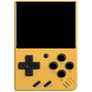

# Introduction
 

&nbsp;

This repository contains the SDL v2.0 source code, ported for the following handheld devices:  
- Miyoo Mini (Plus)  
  Utilizes SigmaStar MI GFX for rendering and is supported on both Stock OS and Onion v4.3.1-1.

&nbsp;

All dependent libraries are stored in the "dependency" folder and need be built manually after building the SDL library.
```
json-c-0.15.tar.gz
SDL2_net-2.2.0.tar.gz
SDL2_ttf-2.20.2.tar.gz
SDL2_image-2.8.1.tar.gz
SDL2_mixer-2.6.3.tar.gz
```

&nbsp;

# How to Build the Source Code
## Miyoo Mini (Plus)
```
$ cd
$ wget https://github.com/steward-fu/website/releases/download/miyoo-mini/mini_toolchain-v1.0.tar.gz
$ tar xvf mini_toolchain-v1.0.tar.gz
$ sudo mini /opt

$ git clone https://github.com/steward-fu/sdl2
$ cd sdl2
$ make cfg

$ make gpu
$ ls swiftshader/build/lib*
    swiftshader/build/libEGL.so
    swiftshader/build/libGLESv2.so

$ make sdl2
$ ls sdl2/build/.libs/libSDL2-2.0.so.0*
    sdl2/build/.libs/libSDL2-2.0.so.0
    sdl2/build/.libs/libSDL2-2.0.so.0.18.2
```

&nbsp;

# How to Build the Examples
## Miyoo Mini (Plus)
```
$ cd
$ git clone https://github.com/steward-fu/sdl2
$ cd sdl2/examples
$ make clean
$ make -j4
```

&nbsp;

# How to Run the Program with SDL Library
## Miyoo Mini (Plus)
Place libSDL2-2.0.so.0, libEGL.so, libGLESv2.so, libjson-c.so.5 and the executable file in the same folder.
```
# kill -STOP `pidof MainUI`
# LD_LIBRARY_PATH=.:/config/lib:/customer/lib ./xxx
# kill -CONT `pidof MainUI`
```
